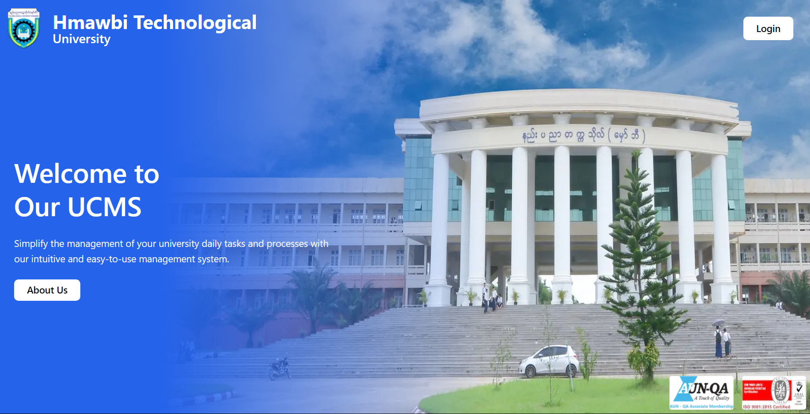
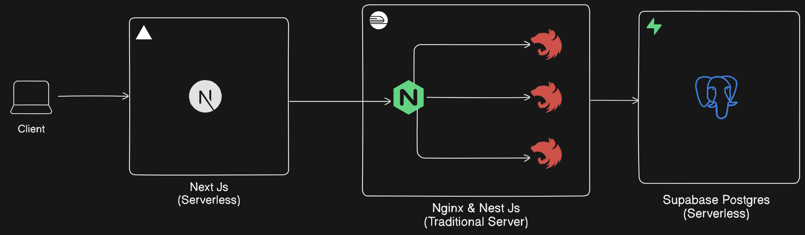

<div align="center">
  <h1>
    University Compus Management System
  </h1>
  <br />
    <a href="https://youtu.be/O5cmLDVTgAs?feature=shared" target="_blank">
      
    </a>
  <br />

  <div>
    
    
    
    
    
    
    
    
    
  </div>

</div>

## 📋 <a name="table">Table of Contents</a>

1. 🤖 [Introduction](#introduction)
2. ⚙️ [Tech Stack](#tech-stack)
3. 💻 [System Design](#system-design)
4. 🔋 [Features](#features)
5. 🤸 [Quick Start](#quick-start)

## <a name="introduction">🤖 Introduction</a>

Welcome to the University Campus Management System, a full-stack application designed to streamline academic and administrative functions for universities. Built with the latest web technologies, this system provides teachers and students with role-specific access to essential resources, ensuring efficiency, ease of use, and secure data management.

## <a name="tech-stack">⚙️ Tech Stack</a>

- Next.js
- Supabase
- Nest Js
- Framer motion
- Nginx
- Shadcn UI
- TailwindCSS
- Serverless APIs
- React Hook Form
- Zod
- TypeScript
- Docker

## <a name="system-design">️💻 System Design</a>

<br />


## <a name="features">🔋 Features</a>

## Teacher

👉 **Role-Based Authentication for Teachers**: Secure login with teacher-specific permissions, ensuring data privacy and access to academic management tools.

👉 **Daily Schedule View**: Access to a daily schedule displaying classes, subjects, times extracted from the central timetable, allowing teachers to stay organized.

👉 **Event Creation and Management**: Enables teachers to create and manage university events, promoting organized campus activities and enhancing communication with students.

👉 **Timetable Management**: Tools to create, update, and organize class timetables, supporting effective scheduling and course planning.

👉 **Subject Management**: Allows teachers to create and manage subjects within their purview, providing a structured approach to academic offerings.

👉 **Exam Scheduling and Management**: A feature for teachers to schedule exams with detailed information on dates, times, locations, and subjects, ensuring clear communication with students.

👉 **Result Creation and Publishing**: Teachers can record and publish exam results, offering students timely access to their grades and feedback.

👉 **Form Validation with Zod and React Hook Form**: Teachers benefit from easy-to-use forms with validation powered by React Hook Form and Zod, ensuring data accuracy and efficiency.

👉 **Modular and Scalable Backend**: Built with NestJS, the backend enables secure, efficient data handling and API calls, supporting scalable functionality for teachers.

👉 **Smooth Animations with Framer Motion**: Enhanced user experience with animations for transitions in schedule viewing, event creation, and data management.

## Student

👉 **Role-Based Authentication for Students**: Secure student login with access restricted to view-only permissions, ensuring data integrity and privacy.

👉 **Viewable Timetable**: Students have read-only access to their complete timetable, displaying subjects, class times, teachers, and classroom locations, helping them manage their day efficiently.

👉 **Classroom Information**: Detailed classroom view where students can see information on enrolled subjects, assigned teachers, and classmates, fostering a collaborative learning environment.

👉 **Exam Schedule Access**: Students can view upcoming exams, including dates, times, locations, and relevant subjects, allowing for better preparation and organization.

👉 **Result Viewing**: A dedicated results page for students to access published grades and feedback from their exams, giving them timely insight into their academic performance.

👉 **Smooth UI with Radix Components**: A responsive, student-friendly interface utilizing Radix UI components for dialogs, tabs, and more, ensuring an accessible and enjoyable experience.

👉 **Server-Side Rendering for Enhanced Experience**: Server-side rendering with Next.js provides students with a fast, responsive interface optimized for SEO and performance.

👉**Security and Performance Features with Nginx**:
Nginx with Rate Limiting and DDoS Protection: The system uses Nginx as a reverse proxy with configured rate limiting and anti-DDoS measures. This setup protects the application from malicious attacks, limits request rates, and ensures stability by handling high volumes of traffic securely.

## <a name="quick-start">🤸 Quick Start</a>

Follow these steps to set up the project locally on your machine.

**Prerequisites**

Make sure you have the following installed on your machine:

- [Git](https://git-scm.com/)
- [Node.js](https://nodejs.org/en)
- [npm](https://www.npmjs.com/) (Node Package Manager)

**Cloning the Repository**

```bash
git clone https://github.com/Beyonds2003/School-Management-System.git
cd School-Management-System
```

**Installation**

Install the project dependencies using npm:

```bash
npm install
```

**Set Up Environment Variables**

Create a new file named `.env` in the root of your project and add the following content:

```env
 JWT_SECRET_KEY=
```

Replace the placeholder values with your actual credentials. You can obtain these credentials by signing up for the corresponding websites on [MongoDB](https://www.mongodb.com/), [Clerk](https://clerk.com/), and [Uploadthing](https://uploadthing.com/).

**Running the Project**

```bash
npm run dev
```

Open [http://localhost:3000](http://localhost:3000) in your browser to view the project.
